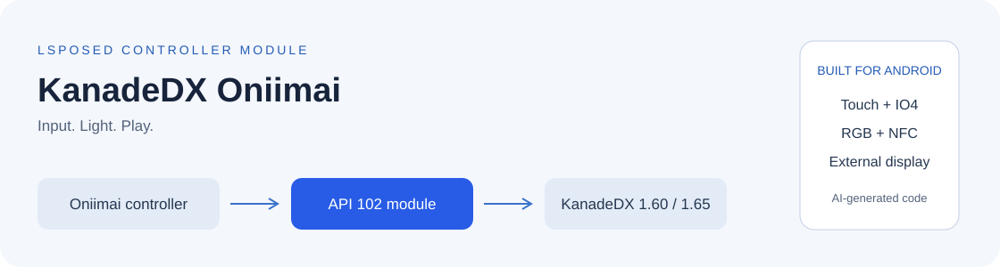
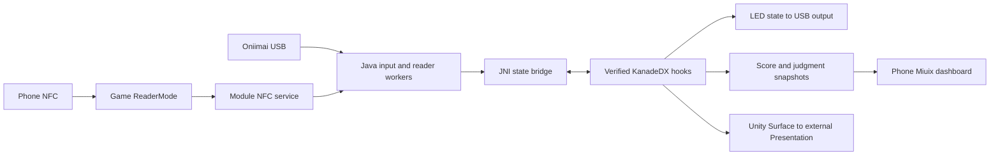

  <picture>
    <source media="(prefers-color-scheme: dark)" srcset="docs/assets/overview.svg" />
    <source media="(prefers-color-scheme: light)" srcset="docs/assets/overview-light.svg" />
    
  </picture>
  <h1>KanadeDX Oniimai</h1>
  
An unofficial, independently developed LSPosed module connecting an Oniimai mini controller to KanadeDX 1.60 on Android.

  
<strong>1.0.0</strong> · LSPosed module · Android 9+ · ARM64 · libxposed API 102

  
<a href="#quick-start">Install</a> · <a href="docs/USER_GUIDE.md">Use</a> · <a href="docs/DEVELOPER_GUIDE.md">Understand the code</a> · <a href="docs/BUILD.md">Build</a> · <a href="docs/README.md">All documentation</a>

**Tested only with KanadeDX-260207.0635 (1.60). Other versions have not been tested.**

**New code, tests and documentation were generated and modified with OpenAI Codex.** Requirements and device feedback came from the maintainer. Third-party code retains its own authorship and licenses. [AI disclosure](AI_DISCLOSURE.md)

> **v1.0.0 · Standalone LSPosed module.** The release contains the module APK, module source and dependency sources. The game, songs, artwork, controller firmware and integrated game APKs are not included.

Contents

- [Features](#features)
- [Quick start](#quick-start)
- [How it works](#architecture)
- [Developer documentation](#development)
- [Validation](#validation)
- [License and credits](#license)

## Features

| Area | What the module provides |
| --- | --- |
| Controller input | Named USB-port selection, 34 touch sensors, eight ring buttons and P1, IO4 HID input |
| Lighting | Game-driven button/ring LEDs, reader LED and upper-speaker RGB |
| Cards | Controller Aime reader and **phone NFC directly inside the game**, with read failures routed into the game flow |
| External display | A portrait game rotated 90°/270° on a landscape monitor, with phone/external switching |
| Phone dashboard | Configurable song, score, judgment, sensor and device widgets; results retained until leaving the result screen |
| Settings | Kotlin · Jetpack Compose · Miuix UI, first-run setup, Korean and Simplified Chinese app languages |

Output refresh rate depends on the modes exposed by the phone, adapter, cable and monitor. Consistent frame delivery is not guaranteed on every setup. Phone MIFARE Classic reading requires compatible NFC hardware.

## Quick start

You need an Android 9+ ARM64 device, an LSPosed environment supporting **modern API 102 and native hooks**, your copy of the supported game, and an Oniimai controller with USB OTG.

1. Install `Oniimai-Kanade-API102-1.0.0.apk` from [Releases](https://github.com/kyarameru0/KanadeDX-Oniimai/releases/tag/v1.0.0).
2. Enable the module in LSPosed and select **KanadeDX (`app.KanadeDX`)** as its scope.
3. Fully stop and restart the game process.
4. Choose a language and monitor orientation in first-run setup. Grant the controller USB permission. Touch and command ports have different roles.
5. Check **Oniimai settings → Connection** inside the game. For phone NFC, enable system NFC and present a card at the game's start/card-wait screen.

A local build uses your own signing key, so it may not install over the maintainer's APK. Back up settings before uninstalling an existing build. [Usage and troubleshooting](docs/USER_GUIDE.md)

**NPatch:** compatibility paths remain in the source, but non-root testing is not verified for this release. Integrated APKs and patching instructions are not provided. [Scope](docs/LEGAL_REVIEW.md#npatch)

## How it works

Blocking I/O stays on workers. Input snapshots cross JNI into game hooks. External output prefers a direct `SurfaceControl` path. Card results are accepted only while the request token and game scan generation still match. [Architecture, code excerpts and sequence diagrams](docs/ARCHITECTURE.md)

## Developer documentation

| Document | Start here for |
| --- | --- |
| [Developer guide](docs/DEVELOPER_GUIDE.md) | Start here: vocabulary, worked examples, code paths and a first-change workflow |
| [Architecture](docs/ARCHITECTURE.md) | Entry points, thread ownership, diagrams and code excerpts |
| [Build](docs/BUILD.md) | SDK/NDK/JDK/Gradle, signing, host tests and optional target verification |
| [Contributing](CONTRIBUTING.md) | Change boundaries, provenance, validation and AI disclosure |
| [Dependencies](docs/DEPENDENCIES.md) | Resolved artifacts, licenses and source hashes |
| [Source provenance](docs/PROVENANCE.md) | Local implementation, actual third-party code and controller references |
| [Controller protocol](docs/CONTROLLER_PROTOCOL.md) | Port roles, sensors and lighting transport |
| [Card protocol](docs/AIME_PROTOCOL.md) / [Phone NFC](docs/PHONE_NFC.md) | Read flow, lifecycle and format limits |
| [Validation](docs/VALIDATION.md) | Automated checks versus physical-device observations |

Most implementation code lives in `app/src/main/java/io/oniimai/kanade/` and `app/src/main/cpp/`. Building the module and running host tests do not require a game APK. The [documentation index](docs/README.md) groups the remaining references by task.

## Validation

The current 1.0.0 module passed **4,983 host checks**, APK notice readback, release compilation, signature and alignment checks. On Xiaomi Android 16, the launcher opened the GPL text and Android Back returned to the notice list. Earlier phone-NFC observations and the remaining device checks are listed separately in [Validation](docs/VALIDATION.md).

## License and credits

Licensed under [GPL-3.0-only](LICENSE). The adapted FeliCa decoder retains its MPL-2.0 option and is also offered under GPL-3.0-only through MPL Section 3.3. Dependency licenses and notices remain applicable. Provide matching source and notices with the APK. License texts are also accessible through the app's offline viewer. [Third-party notices](THIRD_PARTY_NOTICES.md) · [Provenance](docs/PROVENANCE.md)

Provided without warranty. Liability is limited as permitted by applicable law and the included licenses. See [Disclaimer](DISCLAIMER.md); it does not restrict your GPL rights.

This is an unofficial project, unaffiliated with the named game, hardware or framework developers. Names describe compatibility. The module license does not grant game, service, card/account or trademark rights. Host-combination and use permissions remain unverified; see the brief [distribution notes](docs/LEGAL_REVIEW.md).
