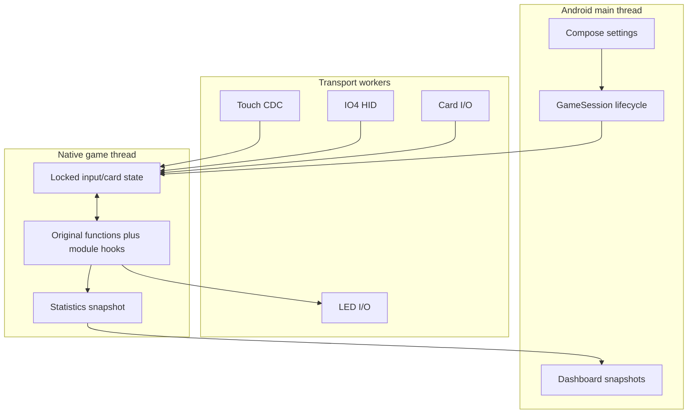
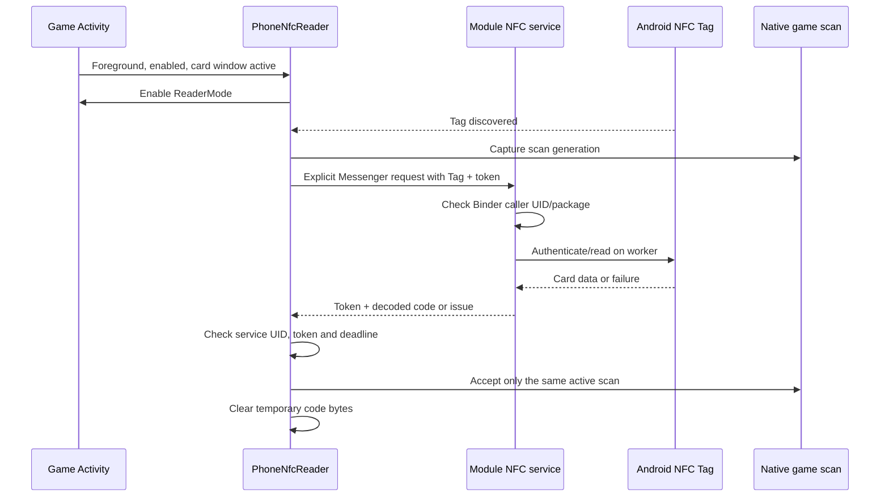
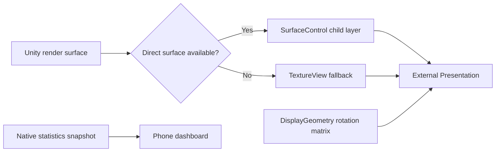

# Architecture and code walkthrough

This document describes the module in this repository, not the original game's source. Examples below are excerpts of module code. Function addresses and managed-field layouts are specific to the supported build.

New to the codebase? Read the [step-by-step developer guide](DEVELOPER_GUIDE.md) first. It follows real inputs through each layer and explains the terminology, ownership and debugging paths.

## Component map

| Layer | Entry points | Responsibility |
| --- | --- | --- |
| Framework | [KanadeModule](../app/src/main/java/io/oniimai/kanade/KanadeModule.java), [NativeLoader](../app/src/main/java/io/oniimai/kanade/NativeLoader.java) | Scope/lifecycle hooks and native module loading |
| Session | [GameSession](../app/src/main/java/io/oniimai/kanade/GameSession.java) | USB ownership, preferences, foreground/input gates, settings and UI snapshots |
| Transport | [UsbIo](../app/src/main/java/io/oniimai/kanade/UsbIo.java), [PortSelection](../app/src/main/java/io/oniimai/kanade/PortSelection.java) | CDC/HID interfaces and persistent role selection |
| Parsing | [Protocol](../app/src/main/java/io/oniimai/kanade/Protocol.java), [Io4Input](../app/src/main/java/io/oniimai/kanade/Io4Input.java) | Validated physical input state |
| Native bridge | [bridge.cpp](../app/src/main/cpp/bridge.cpp), [input_state.h](../app/src/main/cpp/input_state.h) | JNI snapshots, short state locks, framework-supplied hooks |
| Game adapters | [gameplay_stats.h](../app/src/main/cpp/gameplay_stats.h), [game_aime.h](../app/src/main/cpp/game_aime.h), [game_ui.h](../app/src/main/cpp/game_ui.h) | Guarded game-version integration |
| USB cards | [AimeReader](../app/src/main/java/io/oniimai/kanade/AimeReader.java), [AimeChannel](../app/src/main/java/io/oniimai/kanade/AimeChannel.java) | Read-only commands, RF timing, deduplication and reconnection |
| Phone cards | [PhoneNfcReader](../app/src/main/java/io/oniimai/kanade/PhoneNfcReader.java), [PhoneNfcService](../app/src/main/java/io/oniimai/kanade/PhoneNfcService.java), [PhoneScan](../app/src/main/java/io/oniimai/kanade/PhoneScan.java) | In-game ReaderMode and stale-result rejection |
| Lighting | [LedOutput](../app/src/main/java/io/oniimai/kanade/LedOutput.java), [CeilingOutput](../app/src/main/java/io/oniimai/kanade/CeilingOutput.java) | Independent output workers and rate/duplicate control |
| Display | [DisplayOutput](../app/src/main/java/io/oniimai/kanade/DisplayOutput.java), [DisplayGeometry](../app/src/main/java/io/oniimai/kanade/DisplayGeometry.java) | Presentation, rotation, direct surface and fallback |
| UI | [NativeUi.kt](../app/src/main/java/io/oniimai/kanade/NativeUi.kt), [NativeDashboard.kt](../app/src/main/java/io/oniimai/kanade/NativeDashboard.kt), [OniTheme.kt](../app/src/main/java/io/oniimai/kanade/OniTheme.kt) | Compose/Miuix screens, widget state and shared design tokens |

## Thread and ownership boundaries



USB I/O must not block Unity or Android drawing. Generation identifiers distinguish new controller connections and game scans from stale work. Closing a claimed interface must not change another interface's line state. Settings/background transitions disarm input instead of letting controller events navigate Android menus.

## 1. Port roles and input

The controller can expose multiple serial interfaces. Selecting the first enumerated port is unsafe: its command endpoint is not the streaming touch endpoint. `PortSelection.role` uses the advertised role names and the IO4 board identity; ambiguous matches stay unresolved.

Excerpt from [PortSelection.java](../app/src/main/java/io/oniimai/kanade/PortSelection.java):

```java
if (n.endsWith(" command")) return COMMAND;
if (n.endsWith(" touch")) return TOUCH;
if (n.endsWith(" led")) return LED;
if (n.endsWith(" nfc")) return NFC;
```

Touch is represented as 34 sensor bits: A1–A8, B1–B8, C1/C2, D1–D8 and E1–E8. IO4 ring/P1 button state is tracked separately. [ControllerInput](../app/src/main/java/io/oniimai/kanade/ControllerInput.java) suppresses repeat key-down and joystick navigation events before Android can turn them into repeated menu presses.

## 2. Verify before installing hooks

[1.60 target metadata](../target-build.json) and [1.65 target metadata](../targets/kanade-260721.1649.json) record each known APK/library/metadata hash and function address. The optional Python verifier selects the profile by ELF build ID and checks the full local APK. At runtime, the native bridge selects one complete profile, then verifies per-function compatibility fingerprints before installing the relevant hook group. Unknown build IDs never fall back to either version.

Version 1.0.0 stores **digests**, not the original 16 instruction bytes. [target_fingerprint.h](../app/src/main/cpp/target_fingerprint.h) computes an FNV-1a value over those bytes:

```cpp
static inline bool matchesTarget(const void* code, uint64_t expected) {
    return targetFingerprint16(code) == expected;
}
```

This is an accidental-version-mismatch guard, not cryptographic authentication. Failed checks leave that integration unavailable. Do not remove them to make an unknown build load. Framework hook/unhook functions are supplied by LSPosed; the module does not ship a hook engine.

## 3. Phone NFC without a scanner screen



The original game lacks NFC permission, so the module service performs tag I/O under its own normal Android NFC permission. A one-time, no-window registration fallback can establish package visibility; it does not scan cards. If the host already has NFC permission, reading runs directly on a worker instead.

Excerpt from [PhoneScan.java](../app/src/main/java/io/oniimai/kanade/PhoneScan.java), reformatted:

```java
boolean complete(long token, long generation, int game, long now) {
    if (token == 0 || token != pending) return false;
    boolean valid = generation == scan && game == 1 && now < deadline;
    pending = 0;
    return valid;
}
```

An old service reply cannot clear a newer pending request. A different reader winning, a changed game scan, timeout, settings or backgrounding invalidates delivery. `PhoneCardReader` contains the testable format logic; `PhoneTagReader` owns Android tag connections; `AimeFelica` is the separately attributed MPL decoder.

## 4. LEDs and reconnects

Game hooks update lightweight LED state. `LedOutput` and `CeilingOutput` send changes from independent workers. NFC reader lighting uses its NFC bus address, not the ring LED port. USB reconnect logic, RF timing and held-card deduplication remain separate concerns. Transport failures must not create a successful card or repeatedly submit the same error to a finished scan.

See [card protocol](AIME_PROTOCOL.md) for the current RF order and [controller protocol](CONTROLLER_PROTOCOL.md) for wire formats.

## 5. External output and dashboard



`DisplayOutput` creates a separate Presentation at the monitor's landscape bounds, applies a rotation/fit transform, and attaches Unity's surface. `SurfaceControl` is preferred to avoid the extra TextureView composition path; fallback remains available. Surface attach/detach ordering and restoring the phone view matter during disconnects.

The phone renders statistics, not a second independent game. `NativeDashboard` consumes snapshots and preserves result data according to game state. Shared design tokens live in `OniTheme`; settings and widgets should not invent screen-specific spacing or typography.

## Extension checklist

For a new controller, extend role detection/parsers with synthetic frames. For a game update, re-derive and verify target facts from an authorized copy. For a new widget, consume snapshots through the existing dashboard host. For any NFC change, test stale callbacks, concurrent readers, malformed frames and cancellation before physical taps.
