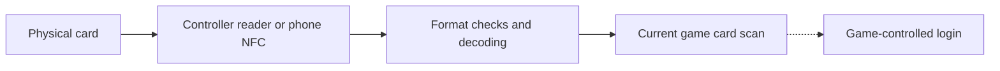

# Card behavior and data boundaries

The stated use is card-based login to a private maimai server through KanadeDX. The module passes a read result to the game; it does not implement the server login itself.

## What is read

| Path | Implementation |
| --- | --- |
| MIFARE Classic | Authenticate sector 0, read blocks 1 and 2, and validate the stored decimal access code. Custom block-1 data is supported; NBGIC, malformed BCD and all-zero codes are rejected. |
| FeliCa | Check the supported system/DFC, read SPAD0, decode it and check supported issuer prefixes. |
| Game handoff | Deliver a code or read failure only to the matching active scan. Ignore stale results after cancellation, a new scan or another reader winning. |

These checks identify supported data formats, not card authenticity or account ownership. The reader paths contain no card-writing API, UID-to-access-code generator or direct account-server client. Fixed authentication constants and decoder tables are present in the source/APK.

## Data handling

The module keeps results transient and excludes identifiers from preferences and diagnostic traces. Some temporary arrays are cleared; immutable strings and copies retained by Android or the game are outside a complete-erasure guarantee. The game's storage and network behavior are separate. Do not share real card numbers, UIDs or raw blocks in bug reports. See [Security and privacy](../SECURITY.md).

For implementation details, start with [PhoneCardReader](../app/src/main/java/io/oniimai/kanade/PhoneCardReader.java), [AimeChannel](../app/src/main/java/io/oniimai/kanade/AimeChannel.java) and [AimeProtocol](../app/src/main/java/io/oniimai/kanade/AimeProtocol.java). [Phone NFC](PHONE_NFC.md) and [USB card protocol](AIME_PROTOCOL.md) explain their lifecycles.

## Use scope

Use cards and accounts you are authorized to access, subject to the relevant operator's terms. The particular private server and its downstream behavior have not been reviewed. Official Aime-service terms are not assumed to govern this private-server use. The module's code license does not grant service or account rights; the project-wide disclaimer and remaining permission limits are recorded once in [License and distribution notes](LEGAL_REVIEW.md).
