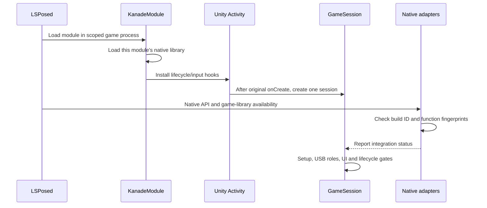
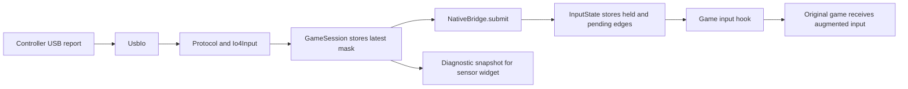

# Developer guide: follow one event through the module

This guide explains the module without assuming experience with Unity hooks or USB controllers. It describes the current implementation, including its limits. Start here, then use [Architecture](ARCHITECTURE.md) for the component map and [Build](BUILD.md) for commands.

## Your first pass through the repository

You do not need a game APK or controller to understand the code or run host tests. Start with one flow instead of reading the entire native bridge.

1. Read the three execution places below. The launcher preview and the injected game UI run in different app contexts.
2. Follow **one button press** in section 2. Open `Protocol`, `Io4Input`, `NativeBridge` and `input_state.h` in that order.
3. Set up the tool paths from [Build](BUILD.md), then run its host-test command. The tests use synthetic reports and small Android fakes.
4. Pick the layer and matching test from the table near the end of this guide. Change that layer first, then build the APK if Android behavior is affected.
5. Record what passed on the host and what you actually observed on a device separately.

| Directory or file | What to open it for |
| --- | --- |
| `app/src/main/java/io/oniimai/kanade/` | Java controller logic and Kotlin Compose/Miuix UI. |
| `app/src/main/cpp/` | JNI implementation, native state and version-specific game adapters. |
| `tests/` | Runnable host checks; `fakes/` supplies only the Android behavior those checks need. |
| `scripts/` | Build, test, locale, target and release-audit commands. |
| `target-build.json` | Identity and checked locations for the supported game build. |
| `docs/` | User guide, this walkthrough and protocol references. |

The [documentation map](README.md) provides a shorter reading route for each task.

## What this project produces

The output is an **LSPosed module APK**, not a game. The game must already be installed. LSPosed loads the module into the selected game process, where it adds controller input and an Android settings/dashboard layer.

The module cannot act as a standalone replacement for KanadeDX. Only **KanadeDX-260207.0635 (1.60)** has been tested. Matching an Android package name alone does not make a different game build compatible.

Three places run different responsibilities:

| Place | What happens there | Starting point |
| --- | --- | --- |
| Module launcher app | Setup information, launch-game action and a local dashboard preview. The preview does not open USB or read game memory. | [MainActivity.java](../app/src/main/java/io/oniimai/kanade/MainActivity.java) |
| Game process | LSPosed lifecycle hooks, USB workers, in-game settings, game adapters and external display. | [KanadeModule.java](../app/src/main/java/io/oniimai/kanade/KanadeModule.java), then [GameSession.java](../app/src/main/java/io/oniimai/kanade/GameSession.java) |
| Module's bound NFC service | Phone-tag I/O using the module app's Android NFC permission when the original game lacks that permission. It has no scanner screen. | [PhoneNfcService.java](../app/src/main/java/io/oniimai/kanade/PhoneNfcService.java) |

The preview and actual game have separate preferences. Editing the preview is not remote control of a running game session. In-game preferences use `oniimai_controller_v1`; the launcher uses `oniimai_ui` and `oniimai_dashboard_preview` in its own app storage.

## A small vocabulary

| Term | Meaning here |
| --- | --- |
| Hook | A replacement function installed at a checked entry point. It can observe or augment a call and invoke the saved original. |
| JNI | The Android bridge between Java/Kotlin and this module's C++ library. [NativeBridge.java](../app/src/main/java/io/oniimai/kanade/NativeBridge.java) declares that boundary. |
| IL2CPP | Unity's compiled native game code. This repository does not distribute the game's native library. |
| RVA / fingerprint | An address relative to the game's loaded library, plus a digest used to detect an unexpected function at that address. These are specific to one build. |
| CDC / HID | USB interface types. CDC carries serial-style messages; HID carries reports such as IO4 button state. One physical controller exposes several interfaces. |
| Bit mask | An integer whose individual bits represent buttons/sensors. A set bit means that input is pressed. |
| Snapshot | A copy of a state at one moment. Widgets read copies instead of reaching into live Unity objects. |
| Generation / token | A counter identifying one connection or card-read attempt. It prevents a late result from being mistaken for a newer request. |

## 1. Starting the game



Native-library availability and Activity creation can occur in different orders. The session periodically checks readiness; it must not assume Unity is ready merely because the settings button is visible.

`KanadeModule` ignores unrelated processes and system-server loading. It preserves the original Activity calls and creates/destroys the session with the game Activity. On Xiaomi Android 16 or later, `UnityStartup` supplies the existing OpenGL ES startup workaround before Unity constructs its graphics device.

The native code verifies the game's ELF build ID, then verifies each relevant function before installing its hook group. In [bridge.cpp](../app/src/main/cpp/bridge.cpp), status `15` means the four core input hooks are installed. It is **not** proof that every optional statistics, LED or card hook succeeded.

| Core status | First thing to investigate |
| --- | --- |
| `-1` | Framework native-hook API unavailable |
| `-2` | Game native library not ready yet |
| `-3` | Unsupported game build identity |
| `-4` | Function fingerprint mismatch, including possible interference from another hook |
| `-5` | Hook installation failed; restart and investigate rather than forcing input on |
| `15` | Four core input hooks installed; inspect optional subsystem status separately |

The FNV fingerprint is a compatibility check, not an authenticity/security signature. Removing a check can turn a clean refusal into a call through the wrong address.

## 2. Pressing one controller button



`PortSelection` recognizes interface names such as `onii-mai touch`, `onii-mai led` and `onii-mai nfc`, plus the IO4 board identity. It restores a stable identity rather than a temporary USB bus address. If more than one interface matches the saved identity, the selection remains ambiguous instead of choosing an arbitrary controller.

The command port and streaming touch port are different roles. Making the first serial port the default caused earlier setup problems; changes to discovery must preserve that distinction.

Touch uses 34 bits. Ring buttons use bits 0–7, and P1 uses bit 8. In [Io4Input.java](../app/src/main/java/io/oniimai/kanade/Io4Input.java), the report's P1 flag becomes `256`, so it remains independent of the eight ring buttons.

The following excerpt from [input_state.h](../app/src/main/cpp/input_state.h) keeps a short press even if it is released before the next game frame:

```cpp
pendingTouch |= t & ~touch;
pendingButtons |= b & ~buttons;
touch = t;
buttons = b;
```

`t & ~touch` identifies newly pressed bits. The pending bits survive until the game's input update consumes them. Holding a button is different from pressing it again: `frame()` derives rising edges from the previous frame, which prevents a held key from producing repeated start/menu actions.

For example, start with an enabled, neutral input state. A press and release both arrive before the next game frame:

| Time | Event | Held button mask | Pending button mask | What the next game update sees |
| --- | --- | --- | --- | --- |
| 2 ms | First ring button pressed | `1` | `1` | Waiting for the game frame. |
| 5 ms | Button released | `0` | `1` | The short press is still pending. |
| 16 ms | `frame()` runs | `0` | Consumed to `0` | One pressed frame and one rising edge. |
| 32 ms | `frame()` runs again | `0` | `0` | Released; no second rising edge. |

These times illustrate the state logic, not a required USB polling schedule. Pending bits preserve a press between updates; they do not count multiple press/release cycles of the same button within one frame. [Native state tests](../tests/native_state_test.cpp) cover the state independently of Unity.

Android menu navigation is guarded separately by `ControllerInput` and `KeyboardState`. Diagnostics can keep showing raw sensor activity while controller-to-game input is suspended for settings or widget editing. After returning, `GameSession` waits for 250 ms of neutral physical input before arming. Stale touch/HID input is cleared after 500 ms; native state also has an expiry guard.

## 3. Reading a card once

Both readers feed the same game-facing card adapter, but use different transports:

| Reader | Transport and parser |
| --- | --- |
| Controller reader | `AimeReader` owns reconnection/lifecycle; `AimeChannel` serializes protocol requests; `AimeProtocol` validates frames. |
| Phone NFC | `PhoneNfcReader` receives a foreground ReaderMode callback; `PhoneTagReader` owns Android tag I/O; `PhoneCardReader` validates formats. A bound service supplies permissioned I/O when required. |

The USB reader has its own NFC port and DTR/RTS state. It must not be reopened merely because an unrelated touch interface reconnects. `UsbIo.Cdc.close()` only changes line state for an interface that this instance actually claimed and configured.

USB timing is intentional: the current channel spaces command traffic and allows RF settling. Removing those waits to increase polling frequency can reintroduce the controller resets observed during earlier device work. See [Aime protocol](AIME_PROTOCOL.md) for current sequencing, not just command numbers.

A valid result is ten BCD bytes: two decimal digits per byte, representing the actual card access code. The implementation validates the supported card format. It does not invent an access code from a generic NFC UID.

For a phone read, [PhoneScan.java](../app/src/main/java/io/oniimai/kanade/PhoneScan.java) tracks one pending token and the game scan generation:

```java
boolean complete(long token, long generation, int game, long now) {
    if (token == 0 || token != pending) return false;
    boolean valid = generation == scan && game == 1 && now < deadline;
    pending = 0;
    return valid;
}
```

Suppose attempt 7 times out, then attempt 8 starts. A late reply for token 7 fails the first check and cannot clear attempt 8. A reply for the right token still fails if the game has moved to a new scan or the six-second deadline expired. Native card state performs its own scan checks before Unity consumes the result.

This is exercised directly in [PhoneNfcTest.java](../tests/PhoneNfcTest.java). After compiling the host suite into `work/tests` as described in the build guide, rerun just that test with:

```powershell
java -cp work/tests io.oniimai.kanade.PhoneNfcTest
```

One scenario begins a read, cancels it, starts a fresh read, and checks that the canceled callback cannot complete the fresh request. If a new NFC change breaks this test, investigate token/generation ownership before changing radio timing. This test uses fixtures; a passing result does not mean a phone antenna or physical card was tested.

The permission service checks the Binder sender's installed package identity. The game-side callback checks the module service UID and token. These checks constrain routing; they do not independently authenticate the game publisher or isolate card data from the game process receiving it.

No card in the field is normal waiting. An unsupported, unreadable or invalid presented card is a failure for the current scan and can reach the game's existing error flow. Cancellation or an obsolete scan must not generate a new error in a later screen. Code buffers are cleared after delivery; avoid adding card numbers, UIDs or raw blocks to logs. Clearing known buffers is not a guarantee that no copy ever exists in Android or the game.

## 4. Updating LEDs without blocking gameplay

Game LED hooks copy color/fade state and call the original game functions. They do not wait for USB writes. Separate Java workers take snapshots and send output.

`LedOutput` handles the configured button/ring path. `CeilingOutput` handles the IO4 output path for speaker/ceiling lighting. Their polling schedules use a 33 ms fixed delay; processing time is additional, so this is not an exact 30 Hz guarantee. The reader's own LED is managed on the NFC channel with its distinct address and reply behavior.

A new lighting feature should follow the same pattern: bounded state capture in the hook, transformation in the output layer, then a cancellable transport operation. Do not put USB retries or sleeping inside a game hook or Compose function.

## 5. Showing the game on an external monitor

Unity renders a portrait 1080 × 1920 buffer. `DisplayGeometry` rotates it by a quarter turn for a landscape external window. On a 1920 × 1080 window, the rotated buffer fits at scale 1. On 3840 × 2160, the scale is 2. A non-16:9 window is fitted proportionally and can have margins; the code does not promise to crop every display to fill it.

`DisplayOutput.External` first attempts a `SurfaceControl` child layer. If that path is unavailable, it uses a `TextureView` fallback. The matrices differ because TextureView first maps a buffer into its own view bounds; its transform must undo that initial scaling.

Disconnect handling must detach Unity from the old surface before its consumer is destroyed, then restore the phone surface. Rotation is a surface transform; it is not implemented by continually capturing the screen into bitmaps.

The phone dashboard renders statistics and controls, not a second game instance. The direct surface requests the display's reported frame rate when the Android API is available. A `setFrameRate` hint does not prove that the monitor switched modes or that frames are presented at that rate. Distinguish game rendering time, Android composition time and the monitor's actual refresh mode when investigating stutter.

## 6. Building a widget or changing settings

The UI has three separate responsibilities:

1. [DashboardLayout.java](../app/src/main/java/io/oniimai/kanade/DashboardLayout.java) stores logical grid positions/sizes and validates arrangements.
2. [DashboardView.java](../app/src/main/java/io/oniimai/kanade/DashboardView.java) hosts scrolling, editing, save/draft behavior and visible refreshes.
3. [NativeDashboard.kt](../app/src/main/java/io/oniimai/kanade/NativeDashboard.kt) draws widget contents using Compose/Miuix and shared [OniTheme.kt](../app/src/main/java/io/oniimai/kanade/OniTheme.kt) tokens.

The native statistics adapter copies data while game objects are valid. `NativeBridge.gameplayStats()` returns copied JSON; a widget does not call a Unity method. Examples of current fields are `title`, `level`, `achievement`, `combo`, `critical`, `fast`, `result` and `scene`. Some unavailable values are omitted, so absence must not automatically be displayed as a measured zero.

Visible dashboard refreshes are scheduled about every 150 ms. That is appropriate for counters and connection status; it is not the input or game-frame clock. The JSON is parsed only when it changes, and offscreen tiles are skipped. Avoid turning every widget into a full-frame polling loop.

Result retention is owned by [gameplay_stats.h](../app/src/main/cpp/gameplay_stats.h) and [stats_state.h](../app/src/main/cpp/stats_state.h): finished statistics survive the transition into Result, and leaving Result clears them. A 30-second fallback prevents an abandoned transition from retaining data forever. A new widget should use this state instead of starting its own result-reset timer.

To add a widget, update the recognized types/defaults in `DashboardLayout`, the type/title choices in `DashboardView`, and the renderer in `NativeDashboard`. Check both 2×2 and 4×2 where supported, long titles, font scaling, dark mode and unavailable data. Saving should commit the editing draft; merely dragging must not overwrite the saved arrangement.

Grid dimensions count logical cells, not pixels. The board has four columns. From `DashboardLayout.defaults()`:

```java
layout.entries.add(new Item(1, SONG, 0, 0, 2, 2));
```

The arguments are **stable ID, widget type, column, row, width, height**. This places the song tile at the top-left in a 2×2 area. A 4×2 tile spans the board's full width. Existing saved layouts are parsed separately, so changing `defaults()` does not automatically rearrange every user's board.

Current size choices are:

| Widget | Supported sizes |
| --- | --- |
| Song, score, fast/late, connection, clock | 2×2 or 4×2 |
| Judgments | 2×2, 4×2 or 4×4 |
| Sensors | 2×2 or 4×4, preserving the round sensor board |

Keep `sizes()`, `validSize()` and the picker in agreement. The parser also retires the old progress/density widget while keeping the remaining saved board. Reusing its old `graph` identifier for a new widget would collide with that migration.

For settings, `GameSession.nativeSettings()` supplies groups/actions, `NativeSettings` models them, and `NativeUi` renders them. Store durable choices through the existing preferences and rebuild only the required views. Use shared spacing, typography, colors and transitions; do not create a separate theme per page. Korean/Chinese strings go through the existing locale mechanism and `check_locales.py`.

For a small first UI change, inspect `OniTokens` in `OniTheme.kt`: `inset` is the shared outer padding, `gap` is the common gap, and `caption` is the small-text size. Follow their usages before editing a value, since changing a shared token affects several screens. To fix one clipped label, first check that label's bounds and wrapping rather than shrinking every font. Verify both app languages and a larger Android font scale on-device.

## 7. Keeping license text visible and current

The launcher and the in-game connection tab both open [LicenseUi.kt](../app/src/main/java/io/oniimai/kanade/LicenseUi.kt). Its dialogs use the same Miuix theme; in the game they pass through `GameSession.protect()` so controller events cannot leak into the game while notices are open. System Back or the top back action dismisses the document and returns to its parent.

The intended stack is **home/settings → notice list → document**. Back dismisses one layer; it does not reopen settings from the document. The 1.0.0 launcher GPL/System Back path has been checked on Xiaomi. Other device paths are tracked in [Validation](VALIDATION.md).

The build copies root `licenses/*.txt` and `THIRD_PARTY_NOTICES.md` into the module APK's `META-INF/licenses/`. [LicenseText.java](../app/src/main/java/io/oniimai/kanade/LicenseText.java) reads those exact entries: the launcher uses its installed APK path, while the injected UI uses the module path already supplied to `GameAssets`, not the host game's APK. Loading runs on an I/O dispatcher, entry names are allowlisted and content is bounded to 2 MiB. Long notices are laid out as lazy paragraphs, rather than one huge text layout on the game thread.

When adding a dependency, update notices and the inventory first, then the viewer list if a separate document is needed. `LicenseTextTest` covers missing, corrupt, oversized and canceled reads; `audit_release.py` compares the packaged notices against the source files. These checks can prove packaging behavior, not authorship or legal permission. Never replace a missing notice with a success message or assume an inaccessible source URL satisfies a recipient's source rights.

## Find the right place for a change

| Symptom or feature | Inspect first | Useful verification |
| --- | --- | --- |
| Wrong automatic USB port | `PortSelection`, `UsbIo` identities | Unique, missing and duplicate-name fixtures |
| Repeated menu presses or lost quick presses | `ControllerInput`, `KeyboardState`, `InputState` | Press/release between frames; held input; settings/focus transitions |
| Card works once, then fails | `AimeReader`, `AimeChannel`, `PhoneScan`, native Aime state | Repeated physical taps, late replies, cancellation, two readers competing |
| Sensor picture is wrong | `SensorBoard`; keep input parsing separate | Label/shape comparison and live diagnostics |
| Statistics vanish in Result | `GameplayStats`, `StatsLifecycle` | Game → loading → Result → exit, plus abort/retry |
| External output stutters or has wrong rotation | `DisplayOutput`, `DisplayGeometry` | Actual active display mode, direct/fallback route and frame timings |
| UI spacing or text clipping | `OniTheme`, `NativeDashboard`, widget bounds | Small screen, 2×2 tiles, font scale and both languages |
| New game version | `target-build.json`, `target_build.h`, affected native adapters | Authorized target verification and feature-by-feature device checks |

## Match the change to an existing test

The host runner is `scripts/test.py`. It compiles the Java checks, then runs the native checks when `--ndk` is supplied. For a quicker rerun after compilation, use `java -cp work/tests io.oniimai.kanade.<TestClass>`; recompile after changing a source file so you do not test old class files.

| Area | Existing checks |
| --- | --- |
| Touch, IO4 input and port selection | [ProtocolTest](../tests/ProtocolTest.java), [HardwareSelectionTest](../tests/HardwareSelectionTest.java) |
| Repeated menu navigation | [ControllerInputTest](../tests/ControllerInputTest.java), [KeyboardStateTest](../tests/KeyboardStateTest.java) |
| Saved widget layouts | [DashboardLayoutTest](../tests/DashboardLayoutTest.java) |
| Display geometry | [DisplayGeometryTest](../tests/DisplayGeometryTest.java) |
| USB card parsing and reconnection | [AimeProtocolTest](../tests/AimeProtocolTest.java), [AimeChannelTest](../tests/AimeChannelTest.java), [AimeReaderTest](../tests/AimeReaderTest.java) |
| Phone NFC format and stale replies | [PhoneNfcTest](../tests/PhoneNfcTest.java) |
| Button/reader/speaker lighting | [LedOutputTest](../tests/LedOutputTest.java), [CeilingOutputTest](../tests/CeilingOutputTest.java), [AimeChannelTest](../tests/AimeChannelTest.java) |
| Native input, statistics and card state | [native_state_test.cpp](../tests/native_state_test.cpp), run through the host runner with `--ndk` |
| USB ownership and cancellation | The separate `scripts/test_usb_transport.py` runner |

Layout-model checks cannot detect a clipped Compose label, and geometry checks cannot measure monitor stutter. Add a device observation for those outcomes. A useful report says which test command ran, what it printed and which physical behavior was observed.

## A practical change-and-check cycle

Make one change at the layer that owns the problem. Run the relevant host checks from [Build](BUILD.md), then build and test the affected device behavior. Host tests can model packet corruption, state transitions and layout bounds; they cannot certify a physical USB controller, NFC antenna or monitor.

For a scoped diagnostic capture after reproducing a problem:

```powershell
adb logcat -d -s OniimaiKanade:I OniimaiPhoneNfc:I OniimaiDisplay:I '*:S'
```

Review the output before sharing it. Keep the device/Android version, module version, exact game build, enabled feature, error category and steps to reproduce. Omit personal card/account data and game dumps. Do not interpret successful core hook installation as successful physical I/O.

When adding a dependency or adapting source, record the upstream file, revision, license and changes in [Provenance](PROVENANCE.md) and [Third-party notices](../THIRD_PARTY_NOTICES.md). Keep the detailed license texts there; the code walkthrough can focus on behavior.
