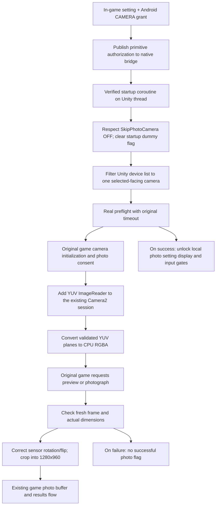

# Experimental phone camera

Module **1.3.38** provides an opt-in adapter under **Labs → Game camera**. It enables the game's photo-setting rows after a real camera check, handles live preview and final capture, centers the single-player crop, and saves front/rear selection with a separate horizontal-mirroring preference for each lens. Live front-camera video and the centered guide/right-preview fixes were confirmed on the connected 1.65 phone. **The latest final-photo orientation and per-lens controls, rear-camera operation and NPatch camera behavior still require device validation.**
The existing input, lighting, NFC and external-display paths are unchanged by this adapter.

## Enable

1. Install the updated module and restart KanadeDX. NPatch users must embed the updated module into their own original game APK; updating the standalone module does not update an embedded copy.
2. Before pressing the game's Start button, open **Oniimai → Labs → Game camera**.
3. Enable **Unlock game photo settings** and grant Camera permission to **the game app**. If permission was permanently denied, enable it in Android's app settings for that exact game/clone package.
4. In KanadeDX's own settings, turn **SkipPhotoCamera OFF**, then restart KanadeDX. The module now respects this setting instead of temporarily forcing it ON.
5. Select **Front camera** (default) or **Rear camera** under **Camera lens**. Set **Mirror horizontally** as desired; the choice is saved separately for each lens (front defaults ON, rear defaults OFF). Restart KanadeDX after changing either setting. This applies consistently to previews, profile photos and newly captured song-result photos. Existing saved images are unchanged.
6. After the real selected-camera preflight succeeds, open the game's settings. **Take photo** (row 1) and **Memorial photo** (row 3) can be selected. Choose each option yourself; the module does not turn either one ON. Use the original consent and shooting screens.

The **Unlock game photo settings** switch defaults to OFF and preserves its selection across restarts (including upgrades from 1.3.27). ON enables the selected-camera compatibility adapter and, after its startup check succeeds, overrides the two local photo-disable queries used by the settings display and input handler. OFF ends the override; restart KanadeDX after changing it. If **SkipPhotoCamera** is ON, it is respected and Labs explains how to turn it off. A camera timeout or lack of the selected camera is not reported as a successful initialization.

The adapter selects only the requested facing and never falls back silently or bypasses Android permissions. Camera selection and mirroring are latched for the running game; changes are saved for the next game startup. It does not change the user's photo options, replace consent screens, add a background camera service, or fabricate a server/upload response. The two original local disable queries also incorporate network/server/area conditions: enabling this experiment overrides those local queries after camera startup, but **does not guarantee that the configured server accepts icon or memorial photos**. The game still controls capture, storage and upload. Switching the adapter off blocks subsequent adapter-owned camera starts/captures and queues a stop on the game thread. Re-enabling after game initialization requires a restart.

## Why an adapter is needed

Read-only inspection of the supplied 1.60 (260207.0635) and 1.65 (260721.1649) builds found:

- `CameraManager.CameraInitialize` rejects a device list containing two or more cameras. A phone can enumerate front and rear cameras, and sometimes additional camera devices.
- The Android port performs a separate camera open/close preflight before the actual camera manager initializes. Its skip-camera path sets an in-memory dummy-camera flag.
- Game photo buffers use 1280×960 pixels. `GamePhotoConteiner.CopyColor` marks a frame enabled before asking Unity to fill a fixed array, without validating the actual delivered frame size or orientation.
- On the tested 1.65 phone, the camera opens and supplies frames, but Unity reports missing `Hidden/VideoDecode` and `Hidden/VideoDecodeAndroid` materials and a failed video-conversion blit. Updating a preview texture alone still produces a black image when the upstream decoder cannot produce RGB.

The missing-shader errors were observed on the connected phone; the other items are compatibility hazards found in code, not a diagnosis of every device's camera failure. The official [KanadeDX FAQ](https://kdx.nightcord.com.de/general/issues/) also documents a song-end photo crash workaround involving Camera permission. That does not establish the exact cause on every phone.

## Implementation

- `FrontCamera.java` manages the opt-in preference and requests permission from the current game Activity. This also targets an NPatch clone's actual package rather than a hard-coded original package name.
- `game_camera.h` installs sixteen hooks only after verifying the loaded IL2CPP build and function fingerprints. Managed metadata and value layouts are checked on the Unity thread. Camera setup failure is isolated from the controller hooks.
- Startup reads `KanadeDXMainSetting.skipPhotoCamera` without writing it. When it is OFF and the adapter is authorized, the existing `SystemConfig` instance's dummy-photo flag is cleared in memory before the real preflight. The game's failure path remains intact, and failed checks keep the photo rows locked. The preflight texture is also stopped on timeout. Success is sampled before `WebCamTexture.Stop`, because some backends reset texture dimensions after stopping.
- `OperationManager.IsIconPhotoDisable` and `IsUploadPhotoDisable` are checked by `RegionalSelectProcess.OnStart` when it builds the rows and by `InputSettingState` when handling touches. Overriding both shared queries enables actual interaction rather than just hiding the disabled overlay. User data, photo consent, the member-formation row and volume are not modified. Disabling the adapter or revoking permission immediately restores original query results; reopen/restart the game to rebuild an already-visible settings window.
- `CameraFrameSource.java` adds one `YUV_420_888` output to the existing Unity Camera2 session and request targets. It never opens a second camera. The hooks are scoped to the game's camera wrapper while the opt-in native adapter is authorized. Each image is closed after a synchronous JNI copy/conversion; wrapper close disposes the reader and worker.
- `camera_yuv.h` validates all three planes' capacities, row strides and pixel strides, converts limited-range YUV to bottom-up RGBA and supplies the same preview/capture conversion. A generation token rejects callbacks from closed sessions. A mutex protects the native buffer; stale frames and repeated capture frames are rejected. This bypasses the missing video shader while retaining the game's original camera lifecycle.
- Managed calls use `il2cpp_runtime_invoke` with exception handling. Managed arrays are held with GC handles across allocations. The camera worker only copies validated pixel data across JNI, never accesses Unity objects. Logs contain dimensions and state only, never pixels or images.
- `PhotographingController.UpdatePreview` reads pixels directly and does not use the camera-manager getter or the game-photo buffer. Its adapter consumes Unity's returned array, normalizes it into the existing game buffers, and uploads a consistent display orientation to both game UI textures: according to the saved mirror setting for the selected camera. The texture returned by the original `GetCaptureTexture` method therefore keeps the same orientation after the shot. The initial P1/P2 quarter-width offsets are removed. The white guide is a separate sliced sprite from the decorative frame; both are positioned over the selected region. The right preview uses a square quad and a crop UV rectangle, rather than an oversized quad relying on the cabinet mask. Its UVs and guide position track the same clamped crop used for final pixels. The game retains subsequent adjustment controls, countdown and photo consent. `GetCameraFrameTexture` populates the matching crop buffer from the same mirror-selected pixels, including the current adjustment offset, before the original frame compositing method runs. Both lenses honor their own saved mirroring preference. The raw source array is reused across frames and replaced if the engine changes its dimensions.
- Version **1.3.36** also covers `SimpleSettingProcess.Capture` and `PhotoShootProcess.CaptureDevelop`. These final-save routines bypass `GetCameraFrameTexture` and independently read a P1/P2 quarter-width rectangle from `_previewTexture`. A thread-local scope replaces only their camera-texture `GetPixels(x, y, width, height)` coordinates with the same rectangle as the preview/adjustment UI. The original frame alpha compositing, 256×256 icon scaling, consent, saving and upload flow remain in the game. The scope ends even when a managed call fails; unrelated texture reads are unchanged. No live frame is fetched during confirmation.
- `PhotographingController.ViewUpdate` keeps the two shutter overlays hidden while the original `_isShutter` flag is false. The game still handles the real shot, countdown and shutter animation; no photograph is triggered by the adapter.
- Version **1.3.37** mirrors the front-camera buffer in `GamePhotoConteiner.CopyColor` after frame normalization and before marking it enabled. The original `WebCamManager.OutputPhotoData` writes this buffer to JPEG and the result screen reads it back. This separate memorial-photo path previously retained the opposite orientation from the profile preview. The correction runs once per fresh capture. Version **1.3.38** makes this orientation selectable for both lenses; result UI artwork and already-saved JPEGs are unchanged.
- `camera_pixels.h` validates dimensions and pixel counts, applies Unity's clockwise rotation and sensor vertical-flip indicators, and center-crops to the game's fixed photo buffer without stretching. Conversion occurs when the game asks for pixels; the module does not add a continuously copied phone-camera dashboard.

## Validation and remaining device checks

- Original 1.60 and 1.65 APKs: build IDs, hashes and all 72 function fingerprints verified.
- Host tests cover skip-ON preservation, skip-OFF eligibility, startup failure, opt-out/permission/background gates, plus clockwise/counterclockwise rotation, vertical-flip order, center cropping, incorrect lengths, placeholder dimensions and oversized frames. Crop regressions cover the final P1/P2 offset bug, manual adjustments at two UI scales, boundary clamping, NaN/Inf rejection and asymmetric mirrored pixels (924 native checks, including repeated memorial captures and in-place horizontal mirroring).
- Release APK compilation, signing, alignment and package audit are performed for delivery.
- Live 1.65 debugging confirmed Android Camera permission, successful front-camera preflight and an active 1280×960 camera stream. After adding the CPU YUV output, the user confirmed that the front-camera image was visible.
- Live 1.65 verification confirmed that the white guide is centered and the right preview fills its square after the shutter-layer fix. The user also confirmed that the black bars were gone.
- **Remaining device checks:** final photo orientation and rear-camera selection; photo consent and countdown; song-end result photo; repeated photos; portrait/landscape and external output; background/resume; denial/revocation of permission; NPatch runtime behavior.
- Managed exception handling cannot recover a native Unity/driver crash. If a particular device still crashes, disable this experimental option and retain its native crash log for diagnosis.

## API references

The implementation is independently written. Relevant API contracts:

- [Android runtime permission requests](https://developer.android.com/training/permissions/requesting)
- [Unity WebCamTexture](https://docs.unity3d.com/ScriptReference/WebCamTexture.html)
- [Unity WebCamDevice.isFrontFacing](https://docs.unity3d.com/ScriptReference/WebCamDevice-isFrontFacing.html)
- [Unity videoRotationAngle](https://docs.unity3d.com/ScriptReference/WebCamTexture-videoRotationAngle.html)
- [Unity videoVerticallyMirrored](https://docs.unity3d.com/ScriptReference/WebCamTexture-videoVerticallyMirrored.html)

Unity's public reference source was consulted only to confirm the front-facing flag's representation. No reference-source implementation, game binary, game asset, disassembly or original APK is included here.
