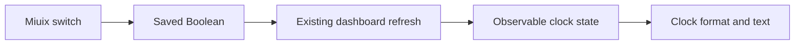

# Implementation recipes

Use this page when you want to **change something and see it work**. The [developer guide](DEVELOPER_GUIDE.md) explains the architecture; these recipes supply complete patches and exact verification steps.

The patches are optional teaching examples, not features enabled in the released APK. They target the runtime source of **v1.0.0** and are supplied in the current `main` checkout. Use one recipe at a time in a clean working tree; combining the patches has not been validated. The original 1.0.0 Source ZIP predates these examples.

| Goal | Recipe | Files changed | Need hardware? |
| --- | --- | --- | --- |
| Add a saved setting and update a widget | [1. Clock seconds](#clock-seconds) | `GameSession.java`, `NativeDashboard.kt` | Compile without hardware; use a phone for UI checks. |
| Add a new optional dashboard tile | [2. P1 status](#p1-widget) | Layout model, picker, Compose content and layout tests | Preview without a controller; P1 response needs one. |
| Extend USB name recognition safely | [3. Touch alias](#touch-alias) | `PortSelection.java`, `HardwareSelectionTest.java` | Synthetic host checks only; a real descriptor needs device confirmation. |

## Before you start

Use a clone of `main`, not the installed APK or an old release ZIP. GitHub authentication is required while the repository is private.

```powershell
git clone https://github.com/kyarameru0/KanadeDX-Oniimai.git
cd KanadeDX-Oniimai
git status --short
git switch -c tutorial-clock-seconds
```

If you already have a checkout, save your existing work before starting; an empty `git status --short` means no tracked/untracked changes. A separate branch names your experiment, but does not automatically protect uncommitted edits.

Set up [JDK, Android SDK/NDK and Gradle](BUILD.md) before an Android compile/build. A game APK, phone or controller is not required for compilation or host tests. The project uses its build script and an unpacked Gradle installation; there is no `gradlew` wrapper.

## Apply, inspect and undo an example

From the repository root, choose the recipe's patch path:

```powershell
$recipePatch = 'docs/examples/01-clock-seconds.patch'
git apply --check $recipePatch
git apply $recipePatch
git diff --stat
git diff
```

`--check` validates whether the patch fits; it does not apply it. Stop if it reports an error. Do not force an old patch over a different implementation. The patches contain full code changes, including Korean/Chinese labels where needed.

To undo **only that example**, before making additional edits to its lines:

```powershell
git apply --reverse --check $recipePatch
git apply --reverse $recipePatch
git status --short
```

The reverse check should pass first. It removes the patch from source, not an installed APK or saved app preferences. Rebuild/reinstall if you want to remove a previously installed example. Start the next recipe from the unchanged baseline, or use another clean checkout.

<a id="clock-seconds"></a>
## 1. Add a saved clock-seconds setting

**Result:** the game's Display settings gains a switch that shows seconds in dashboard clocks. The default is OFF, preserving the released appearance. [Complete patch](examples/01-clock-seconds.patch).

### Step 1: Describe the switch beside its owner

Open [GameSession.java](../app/src/main/java/io/oniimai/kanade/GameSession.java), find `renderDisplayTab()`, then the `phone` settings group. The patch adds a `phone.toggle(...)` row using the existing Korean/Chinese `tr(...)` labels.

Its two state operations are:

```java
prefs.getBoolean("dashboard_clock_seconds", false)
value -> prefs.edit().putBoolean("dashboard_clock_seconds", value).apply()
```

These are the checked-value and callback arguments in the complete patch, not standalone statements to paste into a method. `NativeUi.settings()` already renders toggle rows as Miuix switches and refreshes the row model after the callback. You do not need a new Activity, dialog implementation or switch theme.

The same key and default must be used by the consumer. This is a game-side preference; it does not change the launcher's separate preview preferences.

### Step 2: Update observable state at the existing refresh point

Open [NativeDashboard.kt](../app/src/main/java/io/oniimai/kanade/NativeDashboard.kt), then `WidgetState.update()`. The patch reads the preference only for clock tiles:

```kotlin
clockSeconds = host.prefs().getBoolean("dashboard_clock_seconds", false)
val unit = if (clockSeconds) 1000L else 60000L
clockMillis = System.currentTimeMillis() / unit * unit
```

The complete patch declares `clockSeconds` with `mutableStateOf` and `clockMillis` with `mutableLongStateOf`. Compose can observe these values. A plain field may change without triggering a redraw.

Rounding limits clock-state changes to once per second or minute. The dashboard already refreshes visible content roughly every 150 ms; do not add a second polling coroutine or background timer per widget. Hidden dashboards retain the existing pause behavior.

### Step 3: Render from that state

The clock branch constructs `Date(state.clockMillis)` and selects `HH:mm:ss` or `h:mm:ss` when enabled. When disabled, it keeps `HH:mm` or `h:mm`. Existing `Metric`, `Caption`, spacing tokens and 2×2/4×2 layout are reused.



### Verify the outcome

Run the locale check and Android compile/build described below. On a device, open the **game's** settings → Display, turn on the new switch, close settings, and inspect a clock tile. Restart the game and confirm the choice remains saved. Check both tile widths, both app languages, 12/24-hour system formats and a larger system font size. OFF should restore the original format.

The launcher preview has no new settings switch in this example. Its clock remains at its own default unless you separately add a preview control. A switch in the game cannot be tested by looking only at the launcher preview.

<a id="p1-widget"></a>
## 2. Add an optional P1 status widget

**Result:** the widget picker gains a `P1 / START` tile with an ON/OFF indicator. Existing saved/default layouts remain unchanged. [Complete patch](examples/02-p1-widget.patch).

### Step 1: Register the stable type

In [DashboardLayout.java](../app/src/main/java/io/oniimai/kanade/DashboardLayout.java), the patch declares `P1 = "p1"` and adds it to the recognized `TYPES` list. This is the persisted identifier, not a translated title. Changing it later requires a saved-layout migration.

The model's ordinary size rules already support 2×2 and 4×2 for newly recognized types. The example uses those rules and does not add a default tile. Avoid changing `defaults()` merely to make a new widget available in the picker.

### Step 2: Expose it in the picker

In [DashboardView.java](../app/src/main/java/io/oniimai/kanade/DashboardView.java), add the same `"p1"` identifier to its picker `TYPES` array, and add cases to `title()` and `description()`. This array is separate from the layout model's type list: updating only one leaves the widget hidden or unable to survive loading.

### Step 3: Copy current diagnostic state

In `WidgetState`, declare an observable Boolean, then update it only for the new type:

```kotlin
if (type == "p1") p1 = host.diagnostic()[0] and 256L != 0L
```

[DashboardHost.diagnostic()](../app/src/main/java/io/oniimai/kanade/DashboardHost.java) returns a snapshot: element 0 contains the eight ring-button bits plus P1 at bit 8 (`256`). The widget reads current state; it does not consume input edges or inject a press into the game. No JNI/native change is required.

This is a sampled status indicator. A very short pulse between dashboard refreshes may not be visible; gameplay's pending-edge handling is a separate mechanism. Do not increase game-thread work to make a diagnostic tile behave like an oscilloscope.

### Step 4: Add the Compose branch

The `"p1"` branch in `WidgetContent()` uses the existing card shell and shared `Metric`, `Caption` and spacing tokens. Do not wrap it in another full widget card; `NativeDashboard.widget()` already supplies the title, margins and background.

### Step 5: Update the affected model checks

[DashboardLayoutTest.java](../tests/DashboardLayoutTest.java) currently expects seven available types and seven default types. With this example there are **eight available types, seven defaults**. The patch preserves the exact default-layout assertion, updates availability expectations and checks adding, resizing and saving/loading P1.

This is why changing only a test's expected count is insufficient: the new tile also needs to persist correctly.

### Verify the outcome

Recompile and run `DashboardLayoutTest` using the commands below. Build the APK, open the launcher dashboard preview → Edit → Add and choose P1. Resize it to 4×2, save, close and reopen. In the game dashboard, hold/release P1 and confirm ON/OFF; opening settings should still suspend gameplay input. A preview without controller input should not be mistaken for a broken USB connection.

<a id="touch-alias"></a>
## 3. Recognize a specific alternate USB name

**Result:** a synthetic CDC descriptor, `onii-mai touch stream`, selects the existing streaming-touch role. This is a teaching name, **not a claim that real Oniimai firmware uses it**. [Complete patch](examples/03-touch-alias.patch).

In [PortSelection.role()](../app/src/main/java/io/oniimai/kanade/PortSelection.java), the patch adds an exact normalized-name check **after the HID branch returns**:

```java
if (n.equals("onii-mai touch stream")) return TOUCH;
```

The preceding code already normalizes case/whitespace and restricts the manufacturer prefix. Placing the rule after the HID return prevents a keyboard/HID interface from being mistaken for a CDC touch stream. Avoid broad conditions such as `contains("touch")` or choosing the first port.

The patch adds five scenarios to [HardwareSelectionTest.java](../tests/HardwareSelectionTest.java): normalized matching, HID exclusion, unrelated-prefix exclusion, ambiguity when two touch ports match, and selection of the streaming protocol. The ambiguity result remains `-2`; it must not silently choose one controller.

Run that test using the commands below. For a real extension, first confirm the actual descriptor and wire protocol. Recognizing a name does not implement a new transport, baud rate or packet parser. Do not apply this teaching alias to released firmware support without that evidence.

## Fast checks for these examples

All commands below run from the repository root with JDK 17's `java` and `javac` on PATH. Recompile after every source edit; rerunning an old class file does not validate a new patch.

```powershell
python scripts/check_locales.py
```

For the P1 layout recipe, compile only the pure-Java model and its test:

```powershell
New-Item -ItemType Directory -Force work/recipe-tests | Out-Null
javac --release 8 -encoding UTF-8 -d work/recipe-tests `
  app/src/main/java/io/oniimai/kanade/DashboardLayout.java `
  tests/DashboardLayoutTest.java
java -cp work/recipe-tests io.oniimai.kanade.DashboardLayoutTest
```

For the USB-alias recipe, include the parser's text dependencies as well:

```powershell
New-Item -ItemType Directory -Force work/recipe-tests | Out-Null
$recipeSources = 'PortSelection', 'SetupDefaults', 'Io4Input', 'Protocol', 'UiText', 'UiTextCatalog' |
  ForEach-Object { "app/src/main/java/io/oniimai/kanade/$_.java" }
javac --release 8 -encoding UTF-8 -d work/recipe-tests @recipeSources tests/HardwareSelectionTest.java
java -cp work/recipe-tests io.oniimai.kanade.HardwareSelectionTest
```

For a Kotlin/UI edit, host Java checks are not enough. Set the tool paths as in [Build](BUILD.md), then either run its full APK builder or use this compile-only check with your unpacked Gradle path:

```powershell
$env:JAVA_HOME = 'C:/Tools/jdk-17'
$env:ANDROID_HOME = 'C:/Android/Sdk'
& "$env:JAVA_HOME/bin/java.exe" -cp 'C:/Tools/gradle-9.1.0/lib/*' `
  org.gradle.launcher.GradleMain -p . `
  :app:compileReleaseKotlin :app:compileReleaseJavaWithJavac --console=plain
```

This last command validates Kotlin/Java integration but does not produce an installable APK. The full [build command](BUILD.md#windows-powershell-example) also compiles the native bridge, packages notices and signs the APK. Before submitting a feature, run the full host suite from that guide and the relevant device checks.

## Install and check your own build

The default output in the build guide is `work/Oniimai-Kanade-API102-1.1.0-rc1.apk`. Select your test device explicitly if more than one is connected:

```powershell
adb devices
$recipeDevice = 'YOUR_DEVICE_SERIAL'
adb -s $recipeDevice install --no-incremental -r work/Oniimai-Kanade-API102-1.1.0-rc1.apk
adb -s $recipeDevice shell am force-stop app.KanadeDX
```

Then open KanadeDX on the device with the module enabled/scoped in LSPosed. Replacing the module APK does not replace classes already loaded in the running game process; fully restarting that process matters. If installation reports a signing-certificate mismatch, use the same key as the installed build or a separate test setup. Do not automatically uninstall a user's build and lose its settings.

## When something does not appear

| Symptom | First check |
| --- | --- |
| Switch shows but has no effect | The same preference key/default must be read by the widget; verify you are in the game dashboard, not the separate launcher preview. |
| Widget absent from Add | Both `DashboardLayout.TYPES` and `DashboardView.TYPES` must include the identifier. |
| Widget disappears after reopening | Check `knownType`, supported sizes and saved-layout parsing; defaults alone do not register persistence. |
| Displayed value never changes | State must be observable, and the visible dashboard must receive refreshes; a held hardware state is easier to test than a short pulse. |
| Host test cannot find `Protocol` or `UiText` | Include all source dependencies in the focused compile, or use the full host runner. |
| New UI still looks like the old build | Confirm the installed APK/signature, LSPosed scope and a fresh game process. |
| Patch no longer applies | Compare its target functions with your branch; do not bypass the context check or discard unrelated work. |

## Verification scope of the supplied patches

Each patch was applied independently to the 1.0.0 source in an isolated working copy. Recipes 1 and 2 passed Android release Kotlin and Java compilation. Recipe 2 passed **490 layout checks**; recipe 3 passed **55 hardware-selection checks**. All three passed the locale checker. Reverse application was also checked against each example's working copy.

These are compile/model checks, not new physical-device tests. The example APKs were not installed and the published module, tag and release assets were not changed by these tutorials.
