# UI preview gallery

Versioned desktop UI renders in light and dark themes. These are sample-data
renders, not Android device screenshots; each section identifies its source
revision where it differs from the current release. The original 1.2.1 gallery
was rendered from `1.2.0-ui`, so some badges show 1.2.0. Setup and About previews
come from later 1.3.x revisions and are not exact 1.3.25 screenshots. Device fonts,
insets, scrolling and real content can differ. The original dashboard sensor
illustration is a placeholder; Android retains its live `SensorBoard` view.

The original 1.2.1 images are unchanged from the supplied `preview/after` set. No game
artwork or real card/account data is shown. The corresponding shared layouts are
in [OniScreens.kt](../app/src/main/java/io/oniimai/kanade/OniScreens.kt) and
[OniTheme.kt](../app/src/main/java/io/oniimai/kanade/OniTheme.kt).

[Current release notes](RELEASE-1.3.25.md) · [Implementation notes](../CHANGES-UI.md)

## Module home

| Light | Dark |
| --- | --- |
|  |  |

## Connection settings

| Light | Dark |
| --- | --- |
|  |  |

## LED settings

| Light | Dark |
| --- | --- |
|  |  |

## First-run setup

Redesigned in 1.3.9. Desktop Compose renders with scripted controller signals; on a device
every state comes from the real USB session.

| Welcome | Connection |
| --- | --- |
| 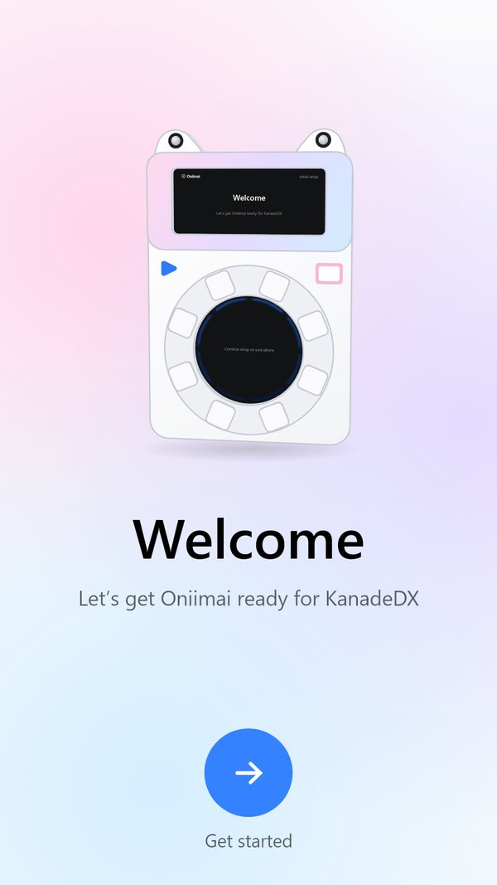 | 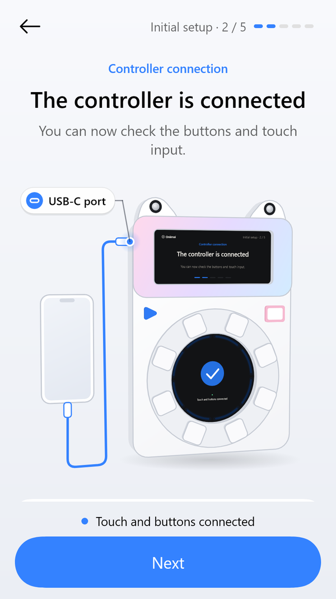 |

| Input check | Built-in screen |
| --- | --- |
| 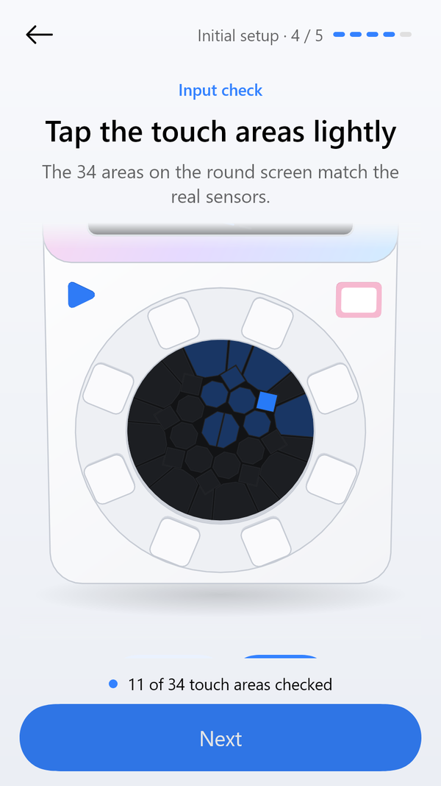 | 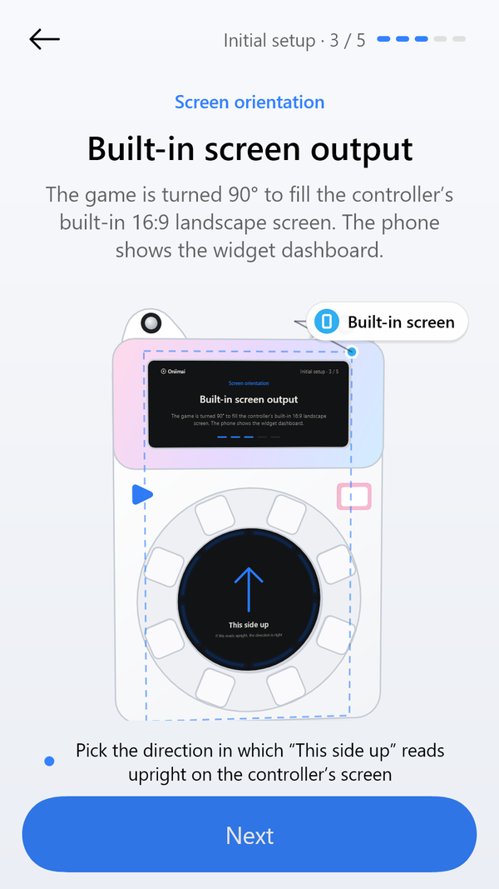 |

| Dark theme |
| --- |
| 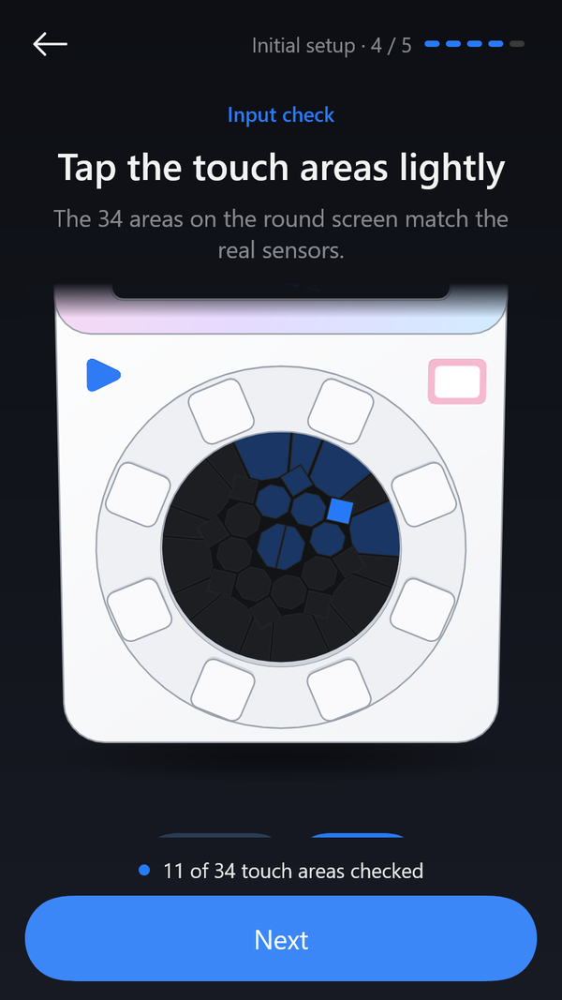 |

Since 1.3.13 the controller's built-in screen shows each setup step too, and the ring buttons light with
it. Shown upright as they read on the controller (the screen itself is mounted a quarter turn, and the
picture turns with the rotation choice). The rim shows the colours the buttons' LEDs show.

| Connection | Input check (touch) | Lighting | Screen orientation |
| --- | --- | --- | --- |
| 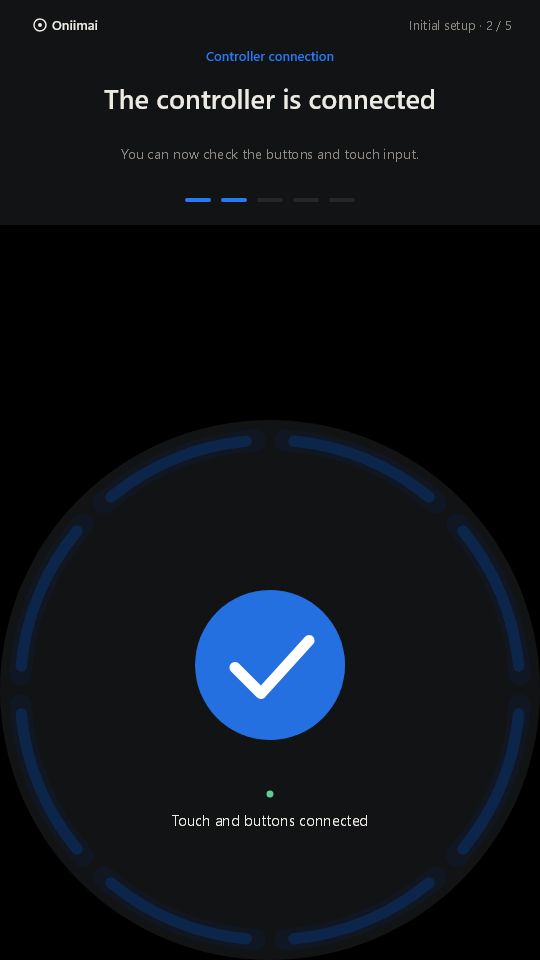 | 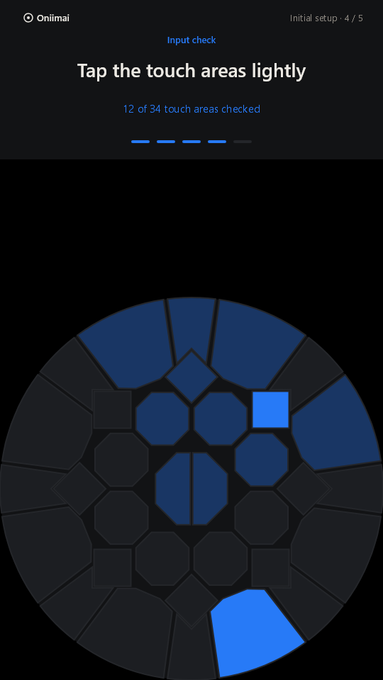 | 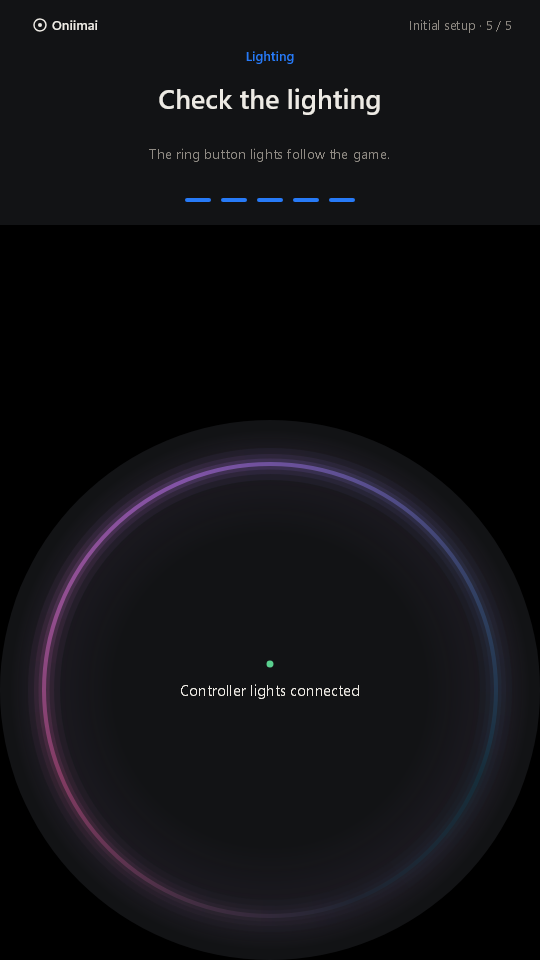 | 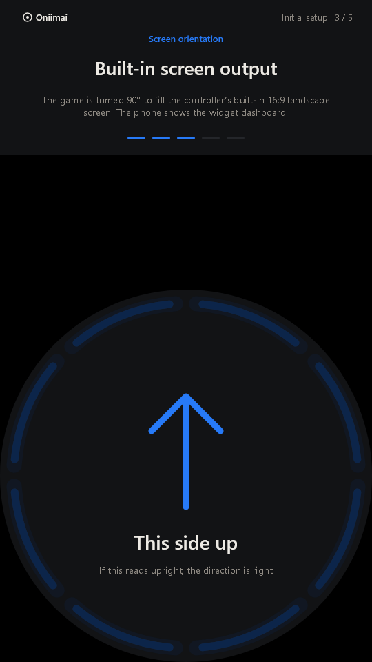 |

## About

Added in 1.3.17 under Settings → General (and on the module launcher's home). Rendered with sample values;
on a device the phone, game version, module status and firmware come from the running session.

| Light | Dark |
| --- | --- |
| 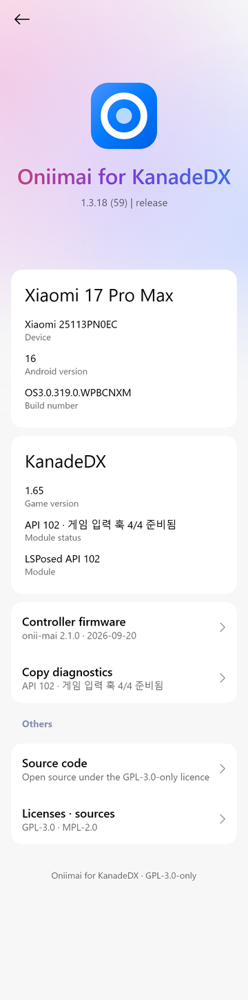 | 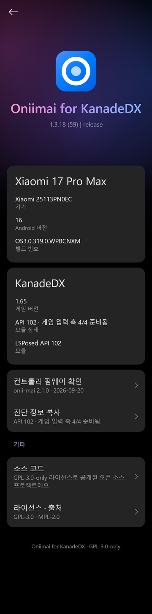 |

## Single-choice list

| Light | Dark |
| --- | --- |
|  |  |

## Numeric input

| Light | Dark |
| --- | --- |
|  |  |

## LED brightness

| Light | Dark |
| --- | --- |
|  |  |

## Licenses and source

| Light | Dark |
| --- | --- |
|  |  |

## Dashboard with sample data

| Light | Dark |
| --- | --- |
|  |  |

## Idle dashboard

| Light | Dark |
| --- | --- |
|  |  |

## Widget editor

| Light | Dark |
| --- | --- |
|  |  |

## External welcome screen

Added in 1.3.5. This is the pre-game lobby on the cabinet monitor, in the rotated
1080x1920 buffer. It has a 1080x450 top panel and the main circle (centre 540,1380,
radius 540). The bezel hides everything else.

These are host renders of the real
[CabinetLobbyView.java](../app/src/main/java/io/oniimai/kanade/CabinetLobbyView.java),
drawn with Skia, sample status text and Windows fonts. They are not device captures.
On Android, it uses the game's fonts (or the system sans-serif fallback). These stills
are frames from the animation, with the clock fixed at 20:42. The ring mirrors the button
LEDs, so the loading frame catches the circling light and the ready frame catches the
wave and a ripple.

| Loading (English) | Ready (English) |
| --- | --- |
| 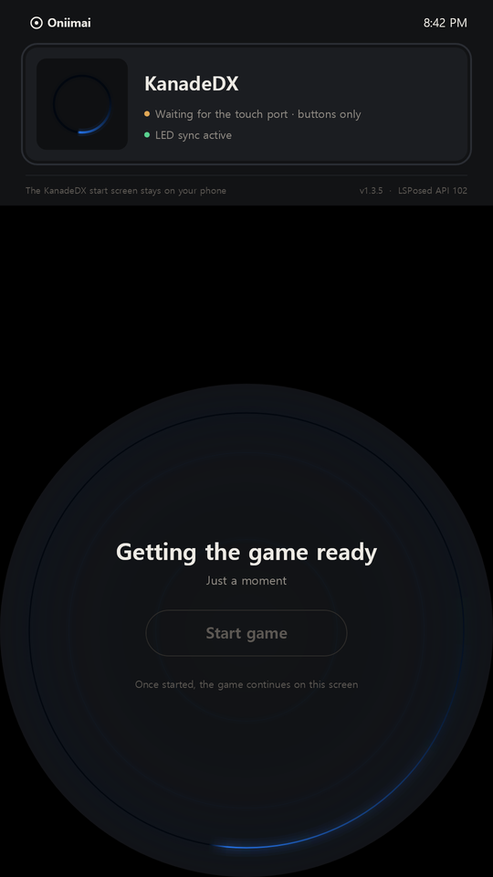 | 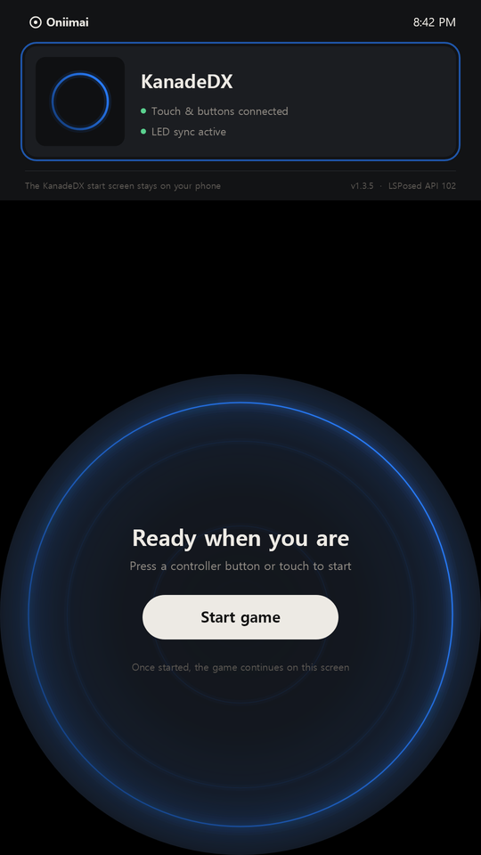 |

| Loading (Korean) | Ready (Korean) |
| --- | --- |
| 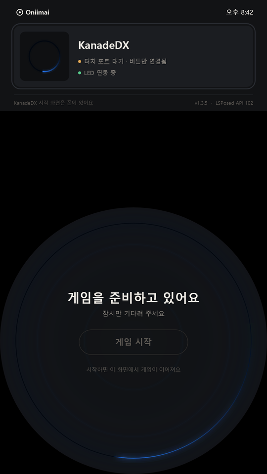 | 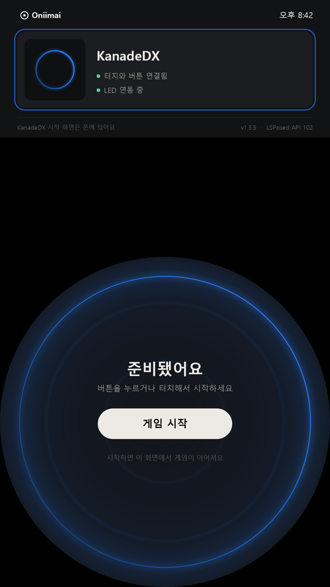 |
