# UI preview gallery

Supplied desktop Compose renders of the UI integrated in 1.2.1, in light and dark themes.
These are sample-data renders, not Android device screenshots. They were made against
the `1.2.0-ui` revision, so some version badges show 1.2.0. Device fonts, insets,
scrolling and real content can differ. The dashboard sensor illustration is a
placeholder; the Android app retains its live `SensorBoard` view.

Images are published unchanged from the supplied `preview/after` set. No game
artwork or real card/account data is shown. The corresponding shared layouts are
in [OniScreens.kt](../app/src/main/java/io/oniimai/kanade/OniScreens.kt) and
[OniTheme.kt](../app/src/main/java/io/oniimai/kanade/OniTheme.kt).

[Release notes](RELEASE-1.2.1.md) · [Implementation notes](../CHANGES-UI.md)

## Module home

| Light | Dark |
| --- | --- |
| 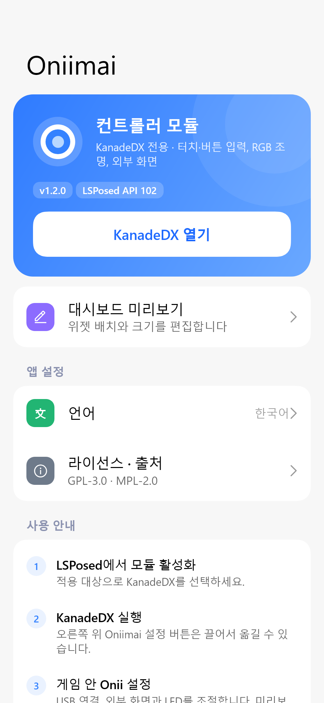 | 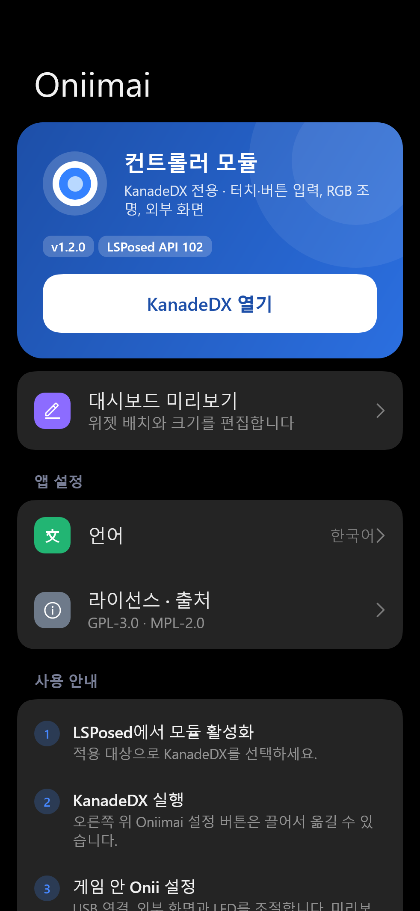 |

## Connection settings

| Light | Dark |
| --- | --- |
| 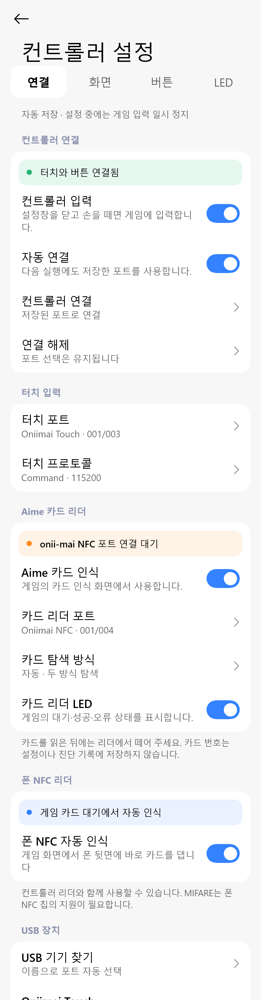 | 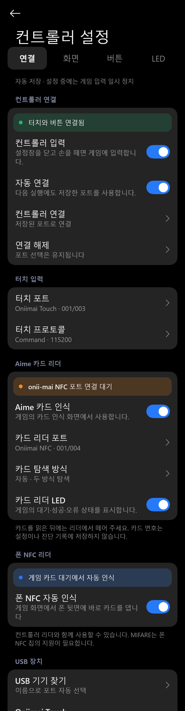 |

## LED settings

| Light | Dark |
| --- | --- |
| 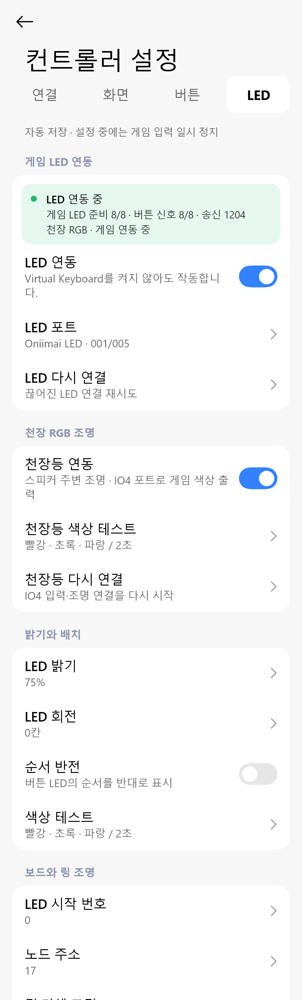 | 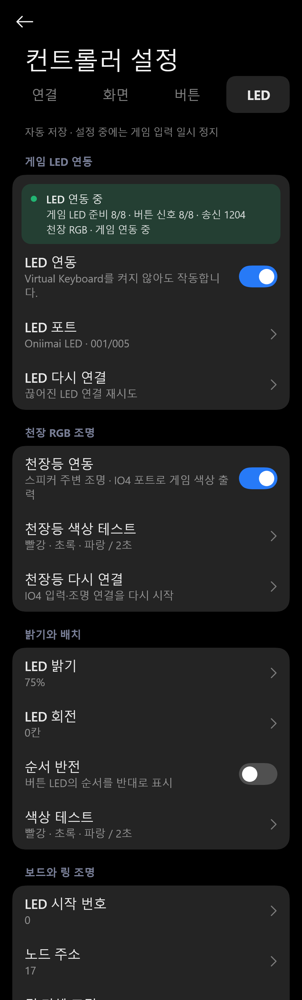 |

## First-run setup

| Light | Dark |
| --- | --- |
| 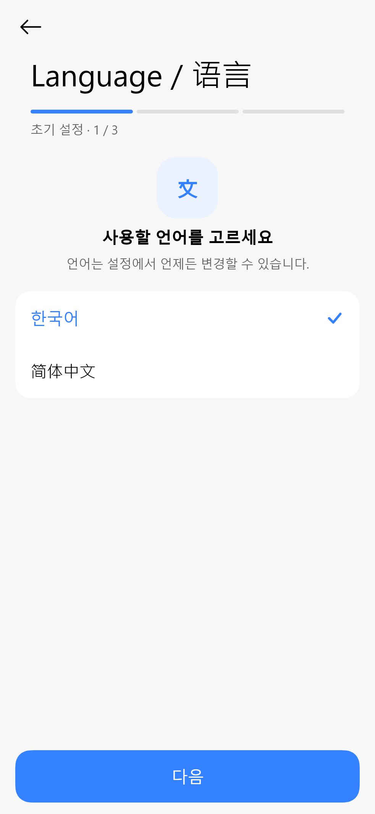 | 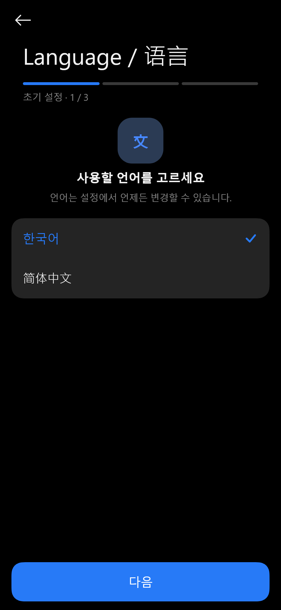 |

## Single-choice list

| Light | Dark |
| --- | --- |
| 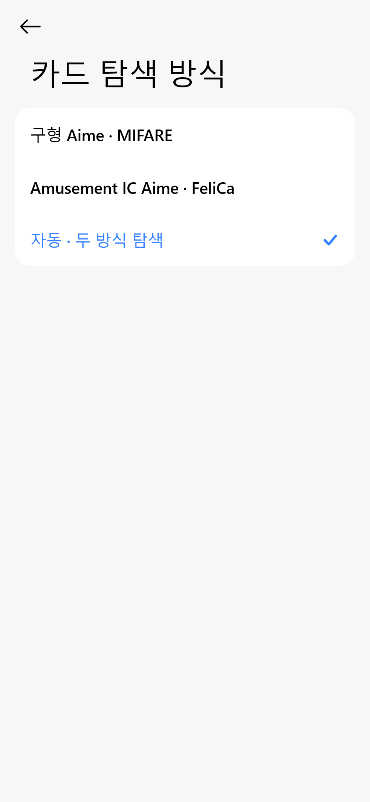 | 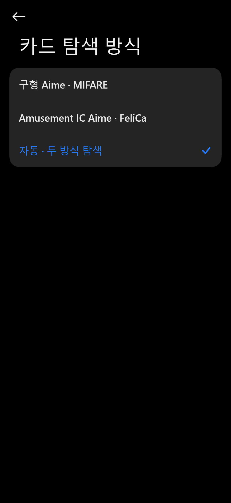 |

## Numeric input

| Light | Dark |
| --- | --- |
| 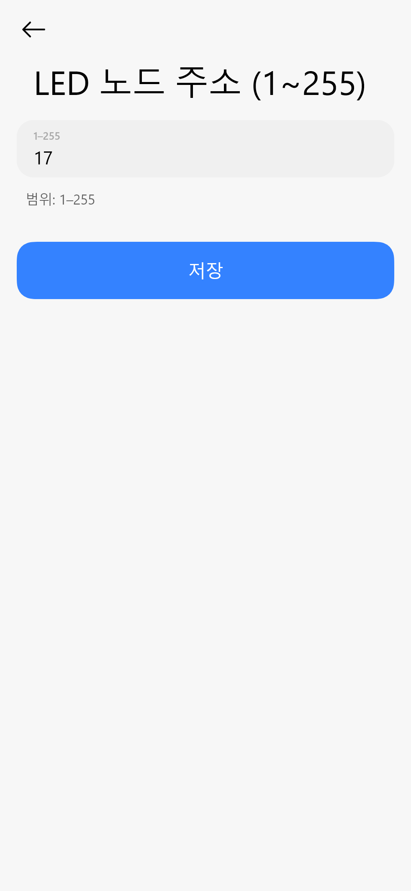 | 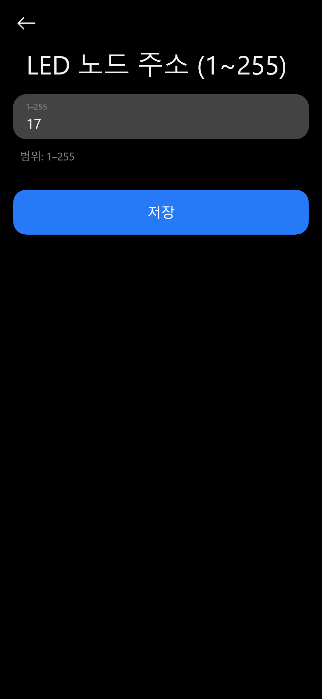 |

## LED brightness

| Light | Dark |
| --- | --- |
| 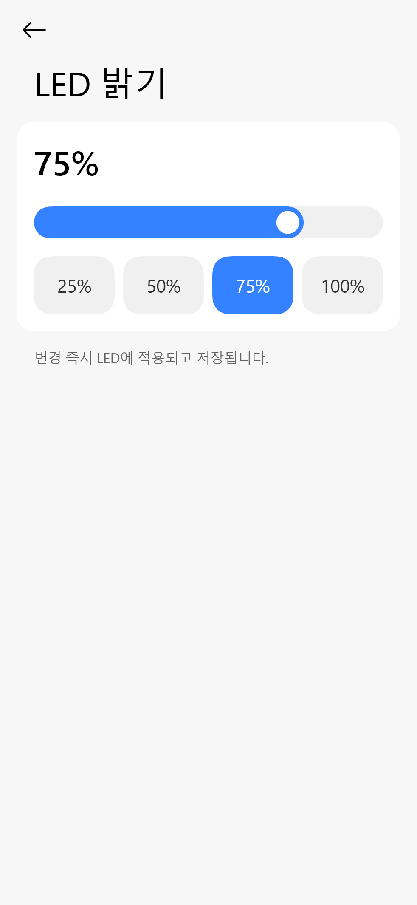 | 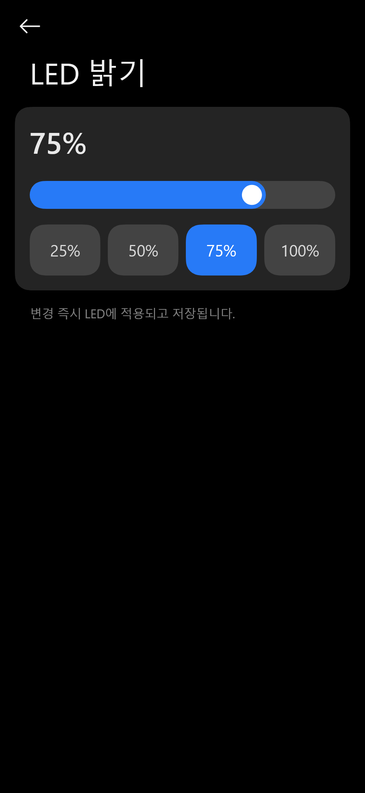 |

## Licenses and source

| Light | Dark |
| --- | --- |
| 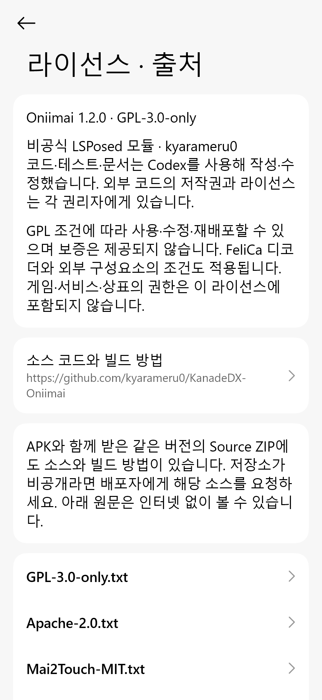 | 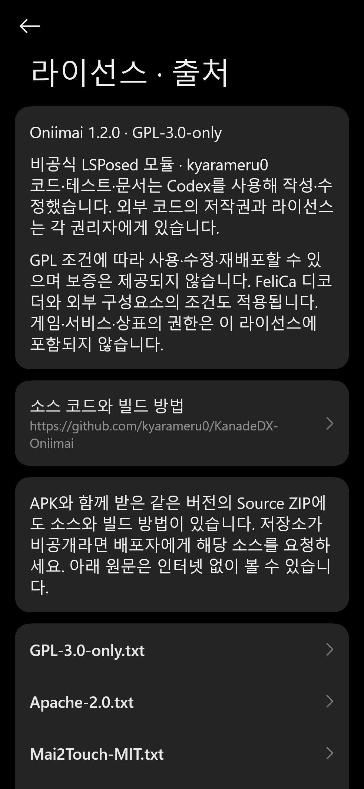 |

## Dashboard with sample data

| Light | Dark |
| --- | --- |
| 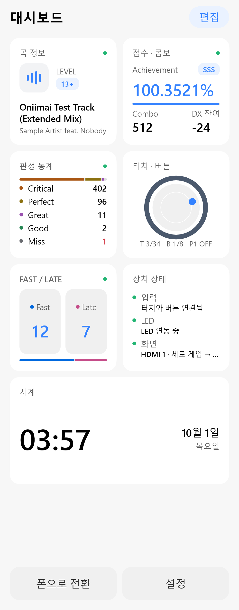 | 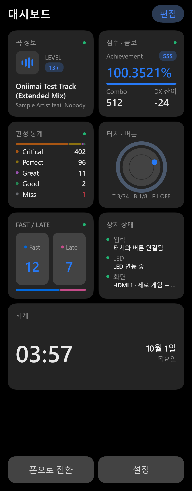 |

## Idle dashboard

| Light | Dark |
| --- | --- |
| 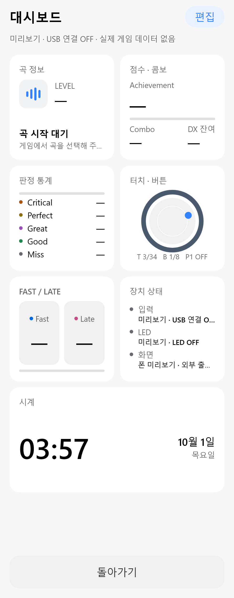 | 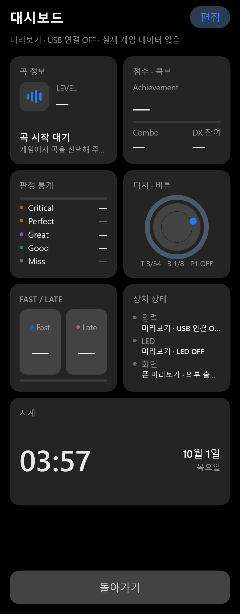 |

## Widget editor

| Light | Dark |
| --- | --- |
| 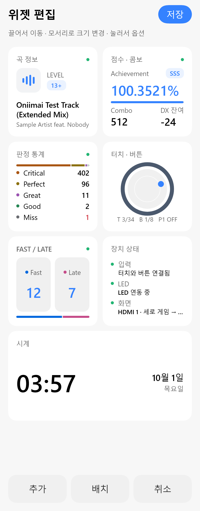 | 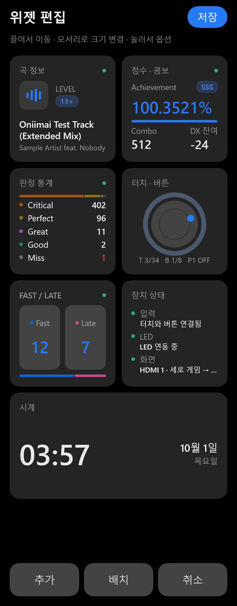 |
